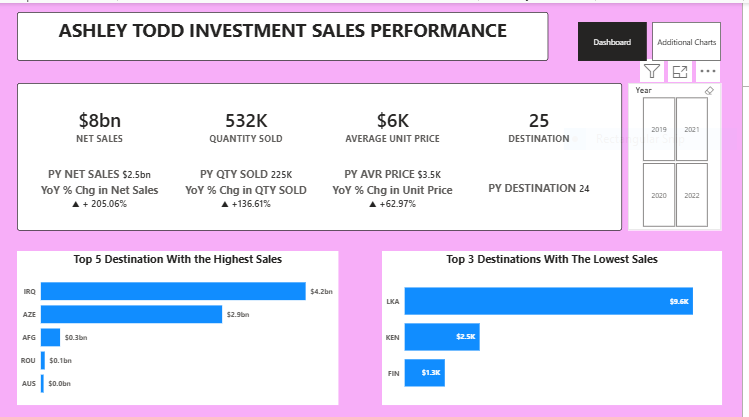
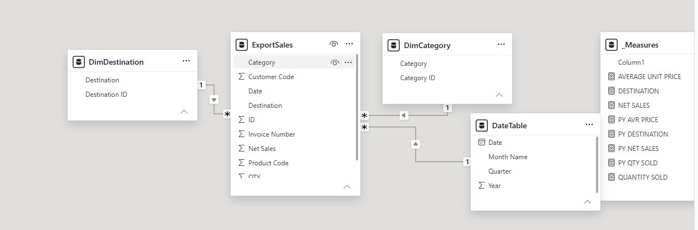

# Ashley Todd Investment Sales Performance
##  Ashley Todd is an international investment company specializing in the distribution and sale of consumer goods. With operations spanning Europe, Africa, and the Middle East, the organization has established a strong presence through its 25 business units across these key markets. 

## Executive Summary
- Management requires data-driven insights into the overall business performance across all outlets, covering the period from inception to date. 
- Developed an interactive power BI which addresses the major concerns of the management to create different KPI cards  and provide other visuals to break down other findings  using the available dataset.
- Delivered a centralized, data-driven reporting solution which shows that the business has made a net sales of $8B and manages an average MRP of $6000 .
## The Business Problem
Stephanie Investment Management is interested in going beyond raw sales figures by leveraging critical KPIs and visual insights to support data-driven decision-making, enabling sustainable growth and long-term business success.
### Key Questions Addressed:
- How have Key Performance Indicators (KPIs) changed.
- Which product categories are leading?
- Which brands generated the most revenue?
- Which outlet generated more sales
## The Process (Methodology)
### Tools Used:
Power BI, Power Query, DAX
### Data Sourcing & Overview
The dataset consists of approximately 460 rows with 10 columns, covering operations across all current regions.
###  Data Cleaning & Transformation (ETL)
Using Power Query, the raw data was transformed to ensure accuracy:
- Removed duplicate entries from the dataset.
- Created a date table
- Removed all the nulls
- Created a net sales Column

## Analysis & Insights
This section breaks down the data into actionable stories.
### The KPI Cards
Over the review period, the business recorded $8 billion in net sales, driven by the sale of more than 532,000 units at an average unit price of $6,000 across its 25 operational locations. 
### Top 5 destinations with the highest sales
Revenue generation was heavily concentrated in five key markets. Iraq led with $4.2 billion in sales, accounting for the largest share of total revenue, followed by Azerbaijan at $2.9 billion. Afghanistan, Romania, and Australia generated $300 million, $100 million, and approximately $45 million, respectively, highlighting their contributions to the business's overall performance. 
### Top 3 destinations with the lowest sales
Revenue performance was weakest in Sri Lanka, Kenya, and Finland. Among these markets, Sri Lanka generated $9,600 in sales, Kenya contributed $2,500, and Finland recorded the lowest revenue at $1,300. These figures indicate minimal market penetration and highlight potential opportunities for strategic growth or market reassessment. 
### Analysis of Net sales by quarter
During the period under review, Q1 emerged as the strongest-performing quarter, generating over $4 billion in total revenue. Q4 ranked second with approximately $2 billion, followed by Q3, which recorded $898 million in revenue. Q2 generated the lowest revenue, contributing a total of $237 million. This trend indicates that the business consistently achieved its strongest financial performance during the first quarter, while the second quarter remained the weakest across the review period. 
### Analysis of Net sales by Year
The analysis demonstrates a consistent year-over-year growth in financial performance from 2019 through 2022. Up from $250M in 2019, figures climbed to $1.6B in 2020, reached $2.1B in 2021, and culminated in approximately $4B by 2022. 
## Recommendations
###  Capitalize on Q1 Momentum & Manage Q2 Cyclicality
- Action: Since Q1 is the dominant revenue driver (over $4B), maximize inventory, marketing spend, and sales team capacity leading into the first quarter to capture peak demand.
- Mitigation: To address Q2 as the weakest quarter ($237M), introduce mid-year promotional campaigns, product bundles, or targeted loyalty incentives to smooth out seasonal dips and stabilize cash flow.
### Standardize Success from High-Performing Markets
- Action: Analyze the operational, marketing, and pricing strategies used in Iraq ($4.2B) and Azerbaijan ($2.9B) to understand why they are driving the vast majority of net sales.
- Replication: Document these best practices into a scalable playbook that can be adapted and deployed in emerging markets like Afghanistan, Romania, and Australia to boost their contributions.
###  Conduct Strategic Market Reassessments for Low-Performing Regions
- Action: For the lowest-performing destinations—Sri Lanka ($9,600), Kenya ($2,500), and Finland ($1,300)—conduct a thorough market viability study.
- Decision Matrix: Determine if low performance is due to a lack of local marketing support (requiring strategic growth investment) or a fundamental mismatch in product-market fit (potentially requiring a strategic exit or pivot to focus resources elsewhere).
###  Optimize Average Unit Price (AUP) and Volume Balance
- Action: With an overall performance of $8B driven by 532,000+ units at an average price of $6,000, monitor the elasticity of this pricing baseline across different regions.
- Strategy: Introduce localized pricing models or premium product tiers in mature markets to safely increase the AUP, while offering flexible entry-level options in lagging regions to stimulate volume.
## Link
[Interactive PowerBI Link](https://app.powerbi.com/view?r=eyJrIjoiOTg3NzU1NWMtOTFhZi00ZWNlLThlMTYtZmU5ZWYzNzU2M2I3IiwidCI6IjY0M2NkODIwLWU2YzYtNGI2ZC05ZDc5LTJjOTgwOTllMTg3MCJ9)
